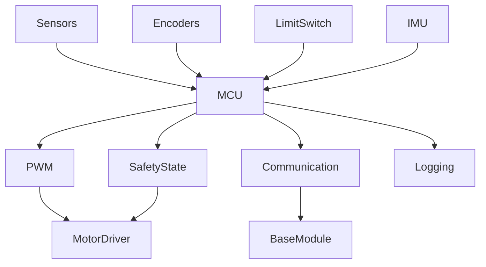

```mermaid
flowchart TD

Sensors --> MCU
Encoders --> MCU
LimitSwitch --> MCU
IMU --> MCU

MCU --> PWM
MCU --> Communication
MCU --> SafetyState
MCU --> Logging

PWM --> MotorDriver
Communication --> BaseModule
SafetyState --> MotorDriver
```
