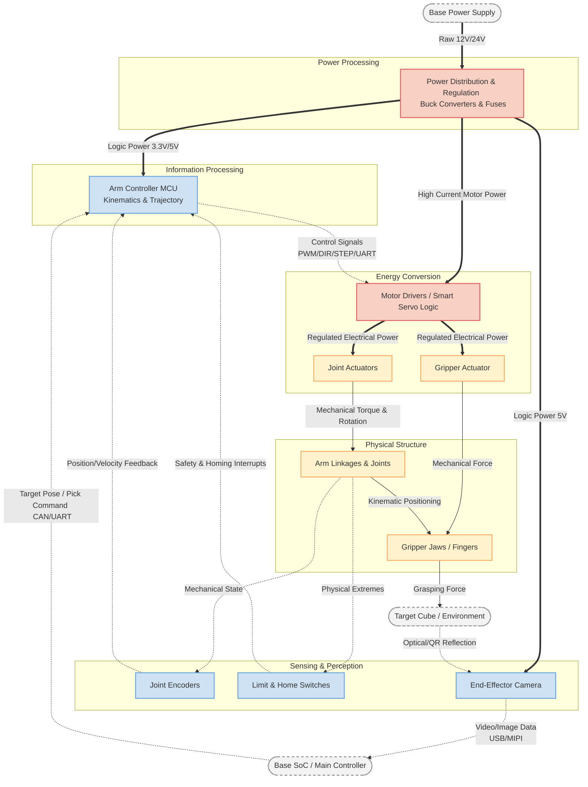

```mermaid
graph TD
    %% Styling Definitions for Domains
    classDef energy fill:#f9d0c4,stroke:#e06666,stroke-width:2px;
    classDef signal fill:#cfe2f3,stroke:#6fa8dc,stroke-width:2px;
    classDef physical fill:#fff2cc,stroke:#f6b26b,stroke-width:2px;
    classDef external fill:#f3f3f3,stroke:#999999,stroke-width:2px,stroke-dasharray: 5 5;

    %% --- External Interfaces (System Boundaries) ---
    BasePwr([Base Power Supply]):::external
    BaseSoC([Base SoC / Main Controller]):::external
    Environment([Target Cube / Environment]):::external

    %% --- Functional Blocks ---
    
    %% Power
    subgraph PowerDomain [Power Processing]
        PwrDist[Power Distribution & Regulation <br/> Buck Converters & Fuses]:::energy
    end

    %% Controller
    subgraph ControlDomain [Information Processing]
        ArmMCU[Arm Controller MCU <br/> Kinematics & Trajectory]:::signal
    end

    %% Actuation
    subgraph ActuationDomain [Energy Conversion]
        MotorDrivers[Motor Drivers / Smart Servo Logic]:::energy
        JointMotors[Joint Actuators]:::physical
        GripperMotor[Gripper Actuator]:::physical
    end

    %% Mechanical/Plant
    subgraph MechanicalDomain [Physical Structure]
        ArmLinks[Arm Linkages & Joints]:::physical
        GripperJaws[Gripper Jaws / Fingers]:::physical
    end

    %% Sensors
    subgraph SensorDomain [Sensing & Perception]
        Encoders[Joint Encoders]:::signal
        LimitSW[Limit & Home Switches]:::signal
        EndCam[End-Effector Camera]:::signal
    end

    %% ==========================================
    %% FLOWS
    %% ==========================================

    %% 1. Energy Flows (Thick Lines)
    BasePwr ==>|Raw 12V/24V| PwrDist
    PwrDist ==>|Logic Power 3.3V/5V| ArmMCU
    PwrDist ==>|Logic Power 5V| EndCam
    PwrDist ==>|High Current Motor Power| MotorDrivers
    MotorDrivers ==>|Regulated Electrical Power| JointMotors
    MotorDrivers ==>|Regulated Electrical Power| GripperMotor

    %% 2. Signal & Information Flows (Dashed Lines)
    BaseSoC -.->|Target Pose / Pick Command <br/> CAN/UART| ArmMCU
    ArmMCU -.->|Control Signals <br/> PWM/DIR/STEP/UART| MotorDrivers
    Encoders -.->|Position/Velocity Feedback| ArmMCU
    LimitSW -.->|Safety & Homing Interrupts| ArmMCU
    EndCam -.->|Video/Image Data <br/> USB/MIPI| BaseSoC

    %% 3. Mechanical & Physical Flows (Solid Lines)
    JointMotors -->|Mechanical Torque & Rotation| ArmLinks
    GripperMotor -->|Mechanical Force| GripperJaws
    ArmLinks -->|Kinematic Positioning| GripperJaws
    
    %% Environment Interactions
    ArmLinks -.->|Mechanical State| Encoders
    ArmLinks -.->|Physical Extremes| LimitSW
    GripperJaws -->|Grasping Force| Environment
    Environment -.->|Optical/QR Reflection| EndCam
```

![[arm_block_diagram.svg]]