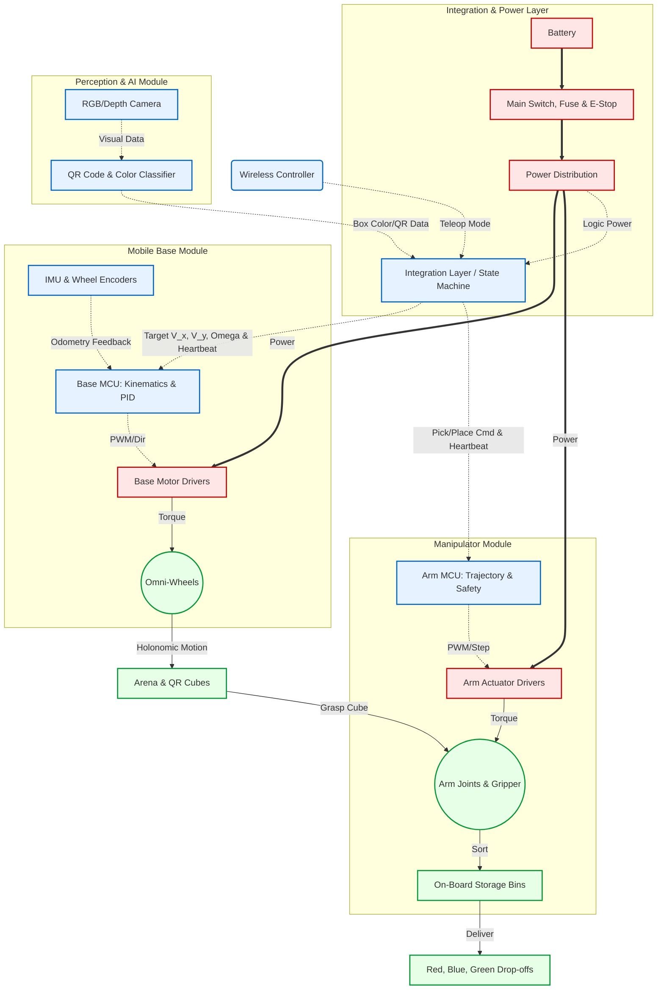

```mermaid
graph TD
    %% Styling Classes
    classDef energy fill:#ffe6e6,stroke:#cc0000,stroke-width:2px;
    classDef signal fill:#e6f2ff,stroke:#0066cc,stroke-width:2px;
    classDef material fill:#e6ffe6,stroke:#009933,stroke-width:2px;
    
    %% External Environment
    Operator(Wireless Controller):::signal
    Track[Arena & QR Cubes]:::material
    TargetZones[Red, Blue, Green Drop-offs]:::material

    %% Central Power & Integration
    subgraph Integration_and_Power [Integration & Power Layer]
        Battery[Battery]:::energy
        BMS_EStop[Main Switch, Fuse & E-Stop]:::energy
        Integration[Integration Layer / State Machine]:::signal
        PowerBus[Power Distribution]:::energy
    end

    %% Perception Module
    subgraph Perception_AI [Perception & AI Module]
        Camera[RGB/Depth Camera]:::signal
        CV_Pipeline[QR Code & Color Classifier]:::signal
    end

    %% Mobile Base Module
    subgraph Mobile_Base [Mobile Base Module]
        BaseMCU[Base MCU: Kinematics & PID]:::signal
        Sensors[IMU & Wheel Encoders]:::signal
        MotorDrivers[Base Motor Drivers]:::energy
        OmniWheels((Omni-Wheels)):::material
    end

    %% Manipulator Module
    subgraph Manipulator [Manipulator Module]
        ArmMCU[Arm MCU: Trajectory & Safety]:::signal
        ArmDrivers[Arm Actuator Drivers]:::energy
        Gripper((Arm Joints & Gripper)):::material
        StorageBins[On-Board Storage Bins]:::material
    end

    %% ---------------- FLOWS ----------------
    
    %% Energy Flows (Thick Red Lines)
    Battery ==> BMS_EStop
    BMS_EStop ==> PowerBus
    PowerBus ==>|Power| MotorDrivers
    PowerBus ==>|Power| ArmDrivers
    PowerBus -.->|Logic Power| Integration

    %% Signal Flows (Dashed Blue Lines)
    Operator -.->|Teleop Mode| Integration
    Camera -.->|Visual Data| CV_Pipeline
    CV_Pipeline -.->|Box Color/QR Data| Integration
    Sensors -.->|Odometry Feedback| BaseMCU
    
    Integration -.->|Target V_x, V_y, Omega & Heartbeat| BaseMCU
    Integration -.->|Pick/Place Cmd & Heartbeat| ArmMCU
    
    BaseMCU -.->|PWM/Dir| MotorDrivers
    ArmMCU -.->|PWM/Step| ArmDrivers

    %% Material/Physical Flows (Solid Green Lines)
    MotorDrivers -->|Torque| OmniWheels
    OmniWheels -->|Holonomic Motion| Track
    ArmDrivers -->|Torque| Gripper
    Track -->|Grasp Cube| Gripper
    Gripper -->|Sort| StorageBins
    StorageBins -->|Deliver| TargetZones
```
