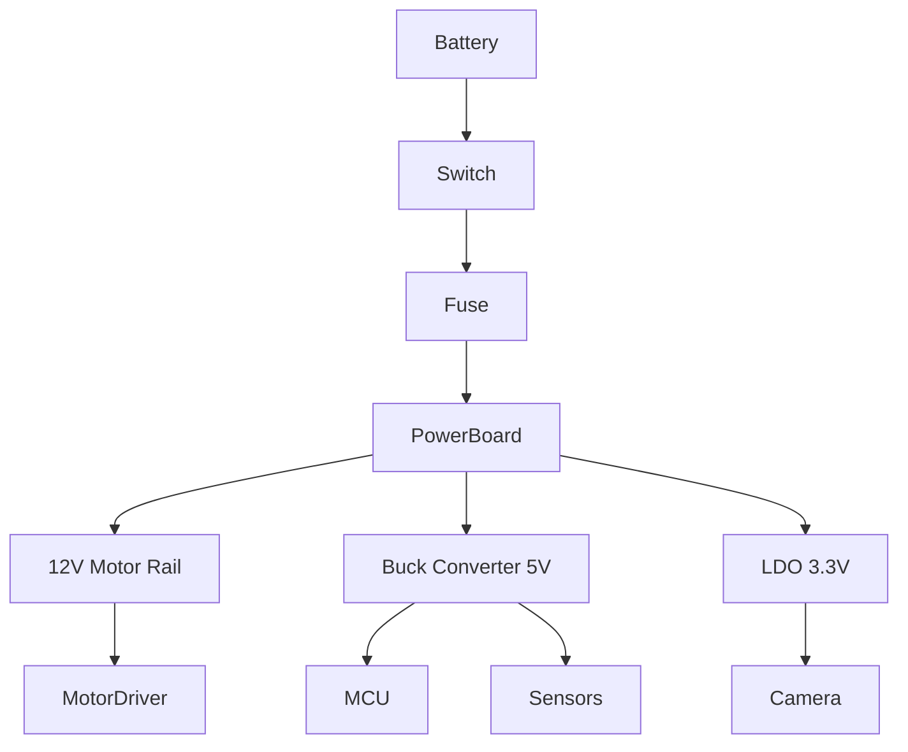

```mermaid
flowchart TD

Battery --> Switch
Switch --> Fuse
Fuse --> PowerBoard

PowerBoard --> MotorRail["12V Motor Rail"]
PowerBoard --> Regulator["Buck Converter 5V"]
PowerBoard --> Regulator3["LDO 3.3V"]

MotorRail --> MotorDriver
Regulator --> MCU
Regulator --> Sensors
Regulator3 --> Camera
```
